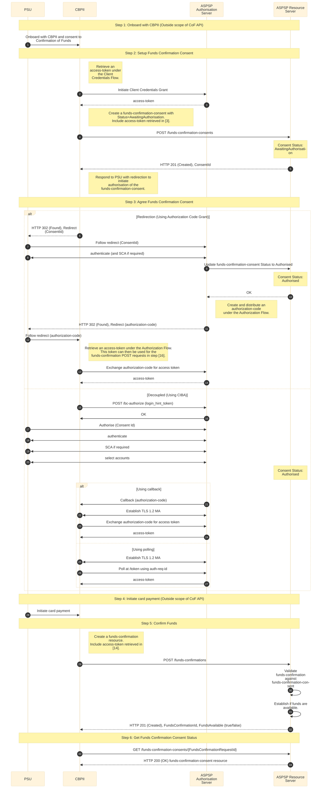

```mermaid
---
config:
    theme: base
    wrap: true
    themeVariables:
        fontFamily: "Metropolis"
    sequence:
        actorMargin: 80
        noteMargin: 14
        boxTextMargin: 12
        boxMargin: 15
---


sequenceDiagram
    autonumber

    participant PSU
    participant CBPII
    participant AS as ASPSP Authorisation Server
    participant RS as ASPSP Resource Server

    Note over PSU,RS: Step 1: Onboard with CBPII (Outside scope of CoF API)

    PSU->>CBPII: Onboard with CBPII and consent to Confirmation of Funds

    Note over PSU,RS: Step 2: Setup Funds Confirmation Consent

    Note right of CBPII: Retrieve an access-token under the Client Credentials Flow.

    CBPII->>AS: Initiate Client Credentials Grant
    AS-->>CBPII: access-token

    Note right of CBPII: Create a funds-confirmation-consent with Status=AwaitingAuthorisation.<br/>Include access-token retrieved in [3].

    CBPII->>RS: POST /funds-confirmation-consents
    Note over RS: Consent Status: AwaitingAuthorisation
    RS-->>CBPII: HTTP 201 (Created),  ConsentId

    Note right of CBPII: Respond to PSU with redirection to initiate<br/>authorisation of the funds-confirmation-consent.

    Note over PSU,RS: Step 3: Agree Funds Confirmation Consent

    alt Redirection (Using Authorization Code Grant)
        CBPII-->>PSU: HTTP 302 (Found), Redirect (ConsentId)
        PSU->>AS: Follow redirect (ConsentId)
        PSU<<->>AS: authenticate (and SCA if required)

        AS->>RS: Update funds-confirmation-consent Status to Authorised
        Note over RS: Consent Status: Authorised
        RS-->>AS: OK

        Note right of AS: Create and distribute an authorization-code<br/>under the Authorization Flow.

        AS-->>PSU: HTTP 302 (Found), Redirect (authorization-code)
        PSU->>CBPII: Follow redirect (authorization-code)

        Note right of CBPII: Retrieve an access-token under the Authorization Flow.<br/>This token can then be used for the<br/>funds-confirmation POST requests in step [16].

        CBPII->>AS: Exchange authorization-code for access token
        AS-->>CBPII: access-token
    else Decoupled (Using CIBA)
        CBPII->>AS: POST /bc-authorize (login_hint_token)
        AS->>CBPII: OK

        PSU->>AS: Authorise (Consent Id)
        PSU<<->>AS: authenticate
        PSU<<->>AS: SCA if required
        PSU<<->>AS: select accounts
        Note over RS: Consent Status: Authorised

        alt Using callback
            AS->>CBPII: Callback (authorization-code)
            CBPII<<->>AS: Establish TLS 1.2 MA
            CBPII->>AS: Exchange authorization-code for access token
            AS->>CBPII: access-token
        else Using polling
            CBPII<<->>AS: Establish TLS 1.2 MA
            CBPII->>AS: Poll at /token using auth-req-id
            AS->>CBPII: access-token
        end
    end

    Note over PSU,RS: Step 4: Initiate card payment (Outside scope of CoF API)

    PSU->>CBPII: Initiate card payment

    Note over PSU,RS: Step 5: Confirm Funds

    Note right of CBPII: Create a funds-confirmation resource.<br/>Include access-token retrieved in [14].

    CBPII->>RS: POST /funds-confirmations

    RS->>RS: Validate funds-confirmation against funds-confirmation-consent
    RS->>RS: Establish if funds are available.

    RS-->>CBPII: HTTP 201 (Created),  FundsConfirmationId, FundsAvailable (true/false)

    Note over PSU,RS: Step 6: Get Funds Confirmation Consent Status

    CBPII->>RS: GET /funds-confirmation-consents/{FundsConfirmationRequestId}
    RS-->>CBPII: HTTP 200 (OK) funds-confirmation-consent resource
```

 

<MermaidExistingBlockPopoutV2 title="Mermaid popup" openLabel="Open diagram" />
